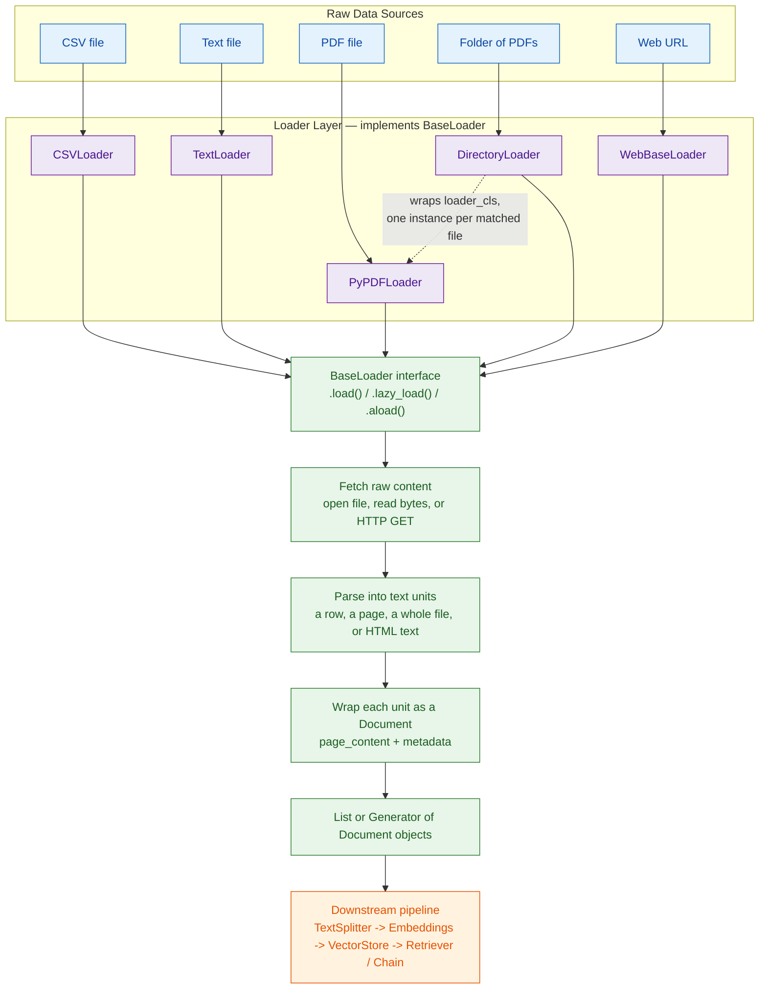

# LangChain Document Loaders

Small practice repo for learning how LangChain's `document_loaders` module works — how different source types (CSV, plain text, PDF, a folder of PDFs, and a live web page) get converted into LangChain's `Document` objects, and how those documents feed into a simple LLM chain.

This isn't a library or a package, it's five standalone scripts written while going through the loaders one at a time, plus the sample data files they run against.

---

## What is a Document Loader?

A **document loader** is the ingestion layer of a LangChain pipeline. Its only job is to pull raw data from wherever it actually lives — a file on disk, a URL, a database, a SaaS API — and convert it into LangChain's standard unit of data, the `Document` object:

```python
from langchain_core.documents import Document

Document(
    page_content="the actual text content",
    metadata={"source": "...", "page": 0}   # anything useful about where this came from
)
```

**Why this exists:** every component downstream of loading — text splitters, embedding models, vector stores, retrievers — is written against the `Document` interface, not against "a PDF" or "a CSV." That's the entire point. A PDF, a CSV row, and a scraped web page have nothing in common structurally, but once each one becomes `page_content + metadata`, the rest of the pipeline can't tell the difference. Swap `PyPDFLoader` for `CSVLoader` and nothing else in the chain needs to change.

Without this abstraction you'd be writing a custom parser *and* custom glue code for every new data source you connect to a pipeline. With it, you write the loader once (or use one someone else already wrote) and every RAG/summarization/QA chain you build downstream stays source-agnostic.

Loaders do **one job only** — they load and lightly parse. They do not chunk text, generate embeddings, or manage storage. That's intentional separation of concerns: chunking is `TextSplitter`'s job, embeddings are the embedding model's job, storage is the vector store's job. Conflating these is a common beginner mistake — expecting a loader to also hand you clean, retrieval-ready chunks.

---

## Architecture — how a loader actually works

Every loader in LangChain — regardless of source type — implements the same abstract interface, `BaseLoader`. That's the whole architectural trick: five completely different scripts in this repo (CSV, text, PDF, a folder of PDFs, a live URL) all end up producing the exact same output shape, because they're all built against the same contract.



**How it works, step by step:**

1. **Instantiate the loader** with whatever config it needs to locate the source — a file path (`CSVLoader(file_path=...)`), a URL (`WebBaseLoader(url)`), or another loader class plus a glob pattern (`DirectoryLoader(path, glob, loader_cls=PyPDFLoader)`). Nothing is read from the source yet at this point — construction is just configuration.
2. **Call `.load()` or `.lazy_load()`.** This is the only method contract that matters. `.load()` returns a plain `List[Document]` — everything is fetched and parsed eagerly, in memory, before you get anything back. `.lazy_load()` returns a generator — it fetches and parses one unit at a time, on demand, as you iterate. `directory_loader.py` in this repo deliberately uses `.lazy_load()` for exactly this reason: a folder of large PDFs shouldn't force every page of every file into memory before you can process the first one.
3. **Fetch the raw content.** Under the hood this is just an `open()` call for local files, or a `requests.get()` for `WebBaseLoader`. This is the part that's actually different for every loader — the interface is shared, the fetch mechanism isn't.
4. **Parse into text units.** This is where the granularity decision gets made, and it's specific to the source type: `CSVLoader` treats one row as one unit, `PyPDFLoader` treats one page as one unit, `TextLoader` treats the whole file as one unit, `WebBaseLoader` runs the fetched HTML through BeautifulSoup and extracts text as one unit.
5. **Wrap each unit as a `Document`.** The parsed text becomes `page_content`; anything useful about where it came from (file path, row number, page number, URL) becomes `metadata`. This is the normalization step — the moment where a CSV row and a PDF page stop being different things and become the same type.
6. **Return the collection** — either the full `List[Document]` (`.load()`) or a generator you iterate over (`.lazy_load()`) — ready to be handed to a `TextSplitter`, straight into a prompt (as in `text_loader.py` and `webbase_loader.py`), or into an embedding step for RAG.

`DirectoryLoader` is worth calling out separately because it isn't really a parser at all — it's a **composite loader**. It doesn't know how to read a PDF; it just walks the directory, finds every file matching `glob='*.pdf'`, instantiates `loader_cls` (here, `PyPDFLoader`) once per matched file, and concatenates the results. It's the same delegation pattern you'd reach for in any codebase when you need "do X for every file in a folder" without duplicating the logic of X.

---

## Types of Document Loaders

LangChain doesn't ship a fixed handful — as of now it has **200+ document loader integrations**, and the list keeps growing as new connectors get added. Trying to memorize all of them isn't useful; what's useful is knowing the categories they fall into, so you can guess where to look for a new source type.

### 1. By file type (local / in-memory files)
| Loader | Reads |
|---|---|
| `TextLoader` | Plain `.txt` files |
| `CSVLoader` | `.csv` files, one row → one `Document` |
| `PyPDFLoader` / `PyMuPDFLoader` / `PDFMinerLoader` | PDFs (multiple backends, different fidelity/speed tradeoffs) |
| `UnstructuredMarkdownLoader` | `.md` files |
| `Docx2txtLoader` / `UnstructuredWordDocumentLoader` | Word documents |
| `UnstructuredPowerPointLoader` | PowerPoint decks |
| `UnstructuredExcelLoader` | Excel spreadsheets |
| `JSONLoader` | `.json` / `.jsonl` files (via `jq` schema) |
| `BSHTMLLoader` / `UnstructuredHTMLLoader` | Local HTML files |
| `NotebookLoader` | Jupyter `.ipynb` files |
| `UnstructuredFileLoader` | Generic catch-all, delegates to the `unstructured` package |

### 2. By data source (remote / API-backed)
| Loader | Reads |
|---|---|
| `WebBaseLoader` | Any live URL (static HTML fetch + BeautifulSoup) |
| `WikipediaLoader` | Wikipedia articles |
| `YoutubeLoader` | YouTube video transcripts |
| `ArxivLoader` | Arxiv papers |
| `GitHubLoader` / `GitLoader` | Repos, issues, commits |
| `NotionDBLoader` | Notion databases |
| `SlackDirectoryLoader` | Exported Slack workspace data |
| `ConfluenceLoader` | Confluence spaces/pages |
| `S3FileLoader` / `S3DirectoryLoader` | AWS S3 buckets |
| `GoogleDriveLoader` | Google Drive files |
| `RedditPostsLoader` / `TwitterTweetLoader` | Social media posts |

### 3. Composite / meta loaders
| Loader | Does |
|---|---|
| `DirectoryLoader` | Wraps another loader and applies it to every matching file in a folder |
| `MergedDataLoader` | Merges the output of multiple loaders into one stream |

### The more useful mental split: structured vs. unstructured
- **Structured sources** (CSV, Excel, JSON, DB rows) already have a schema — loading is close to a direct field-to-text mapping, low ambiguity.
- **Unstructured sources** (PDF, Word, web pages, images-with-text) have no fixed schema — the loader has to do real parsing/extraction work, and this is where fidelity varies a lot between loader implementations (e.g. `PyPDFLoader` vs `PyMuPDFLoader` can extract the same PDF differently).

This repo only touches **5** of the 200+: `CSVLoader`, `TextLoader`, `PyPDFLoader`, `DirectoryLoader`, and `WebBaseLoader` — one structured, the rest unstructured.

---

## Repo contents

| File | Loader | What it does |
|---|---|---|
| `csv_loader.py` | `CSVLoader` | Loads `Social_Network_Ads.csv`, one `Document` per row |
| `text_loader.py` | `TextLoader` | Loads `cricket.txt`, pipes it into a summarization chain |
| `pdf_loader.py` | `PyPDFLoader` | Loads a single PDF, one `Document` per page |
| `directory_loader.py` | `DirectoryLoader` + `PyPDFLoader` | Batch-loads every PDF in a `books/` folder |
| `webbase_loader.py` | `WebBaseLoader` | Scrapes a live URL, pipes it into a Q&A chain |

Data files included: `Social_Network_Ads.csv`, `cricket.txt`.

**Not included** (referenced in the scripts, bring your own): `dl-curriculum.pdf`, and a `books/` folder with a few PDFs in it for `directory_loader.py` to actually have something to glob against.

---

## Setup

```bash
python -m venv venv
source venv/bin/activate        # venv\Scripts\activate on Windows

pip install langchain langchain-community langchain-openai python-dotenv pypdf beautifulsoup4
```

`text_loader.py` and `webbase_loader.py` call an LLM, so a `.env` file is needed in the root:

```
OPENAI_API_KEY=sk-...
```

---

## The scripts

### `csv_loader.py`

Every row of the CSV becomes its own `Document`, with the row's columns flattened into `page_content` as `"key: value"` lines, and `{'source': ..., 'row': n}` in metadata. For a 400-row file, `len(docs)` is 400. Fine for small files — for anything large, one-document-per-row is a design decision worth questioning depending on what you're actually retrieving later.

### `text_loader.py`

The simplest loader — the whole file becomes a single `Document`. This script is the clearest end-to-end example in the repo: load → inspect → wire the content straight into an LCEL chain (`prompt | model | parser`) for summarization.

### `pdf_loader.py`

`PyPDFLoader` returns **one `Document` per page**, not one per file — `len(docs)` here is the page count. This is the detail that trips people up first time: expecting a single document and getting a list the length of the PDF instead.

### `directory_loader.py`

`DirectoryLoader` wraps another loader (`PyPDFLoader` here) and applies it to every file matching `glob='*.pdf'` inside `books/`. This uses `.lazy_load()`, which returns a generator instead of a list — matters once the folder has a lot of large PDFs, since it avoids holding every page of every file in memory at once. Note this script only prints `document.metadata`, not `page_content`.

### `webbase_loader.py`

`WebBaseLoader` does a plain HTTP GET and parses the static HTML with BeautifulSoup — **it does not execute JavaScript.** The URL here is a Flipkart product page, which is a JS-heavy SPA, so `docs[0].page_content` is likely to contain mostly navigation/boilerplate text rather than clean product details. The chain will still return a confident-sounding answer regardless — that's the trap. For JS-rendered pages, `SeleniumURLLoader` or `PlaywrightURLLoader` (both render the page in a real/headless browser first) are the correct tools, not `WebBaseLoader`.

---

## Notes and gotchas (things worth actually knowing, not just running)

- `CSVLoader` = one `Document` per row. `PyPDFLoader` = one `Document` per page. `TextLoader` = one `Document` total. Same interface, very different granularity — always check `len(docs)` against what you expect before building anything on top.
- `.lazy_load()` returns a generator, not a list — you can't index into it or call `len()` on it directly, you have to iterate.
- `WebBaseLoader` is a static scraper, not a browser. Don't point it at JS-rendered pages and trust the output without checking `page_content` first.
- Loaders don't chunk or embed anything — that's still your job via a text splitter and an embedding model afterward.
- Both LLM-calling scripts need `OPENAI_API_KEY` set via `.env`, or `ChatOpenAI()` will fail on instantiation/call.

---

## Things to try next

- `JSONLoader` and `UnstructuredLoader` for messier real-world files
- Compare `WebBaseLoader` output against `PlaywrightURLLoader` on the same JS-heavy page, to actually see how much content gets lost
- Run a `RecursiveCharacterTextSplitter` over the CSV/PDF docs before doing anything RAG-related, instead of using the raw per-row/per-page documents directly
- A proper `requirements.txt` instead of installing things ad hoc

---

## Mental model

A loader's only contract is: **turn some external source into a list of `Document(page_content, metadata)` objects.** Everything downstream in LangChain — splitters, embeddings, retrievers, chains — is built to consume that one shape, regardless of whether the data came from a spreadsheet, a PDF, or a website. Once that clicks, loaders stop feeling like 200 separate APIs to memorize and start feeling like the same pattern with a different parser underneath.
